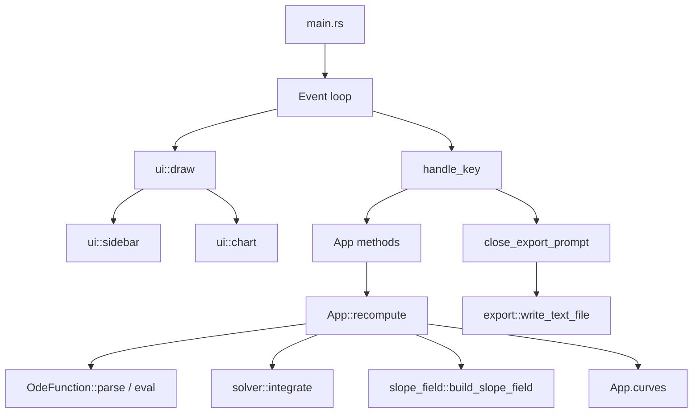

# Code structure

This document is for someone reading the **Numerical ODE Approximater** source for the first time. It describes how the pieces fit together and where to look for common behavior.

The user guide lives in [INSTRUCTIONS.md](INSTRUCTIONS.md). This file is about the Rust layout only.


---

## Overview

The project is a small Rust library plus a TUI binary:

- **`numerical_approximater`** (library) — parsing, integration, state, rendering, export.
- **`numerical_approximater` binary** (`src/main.rs`) — terminal setup, keyboard input, main loop.

Benchmarks in `benches/hot_path.rs` use the library directly (no TUI).


---

## Directory layout

```text
src/
├── main.rs           # Binary: event loop and keyboard routing
├── lib.rs            # Crate root; re-exports all modules
├── app/
│   ├── mod.rs        # App state, recompute, export dialog logic
│   ├── model.rs      # Method, MethodChoice, CurveSeries
│   └── focus.rs      # Focus, ExportPromptFocus, tab order
├── expr/
│   ├── mod.rs        # OdeFunction: parse + eval F(x,y)
│   └── parse.rs      # Tokenize, validate, normalize user equations
├── solver.rs         # Euler / improved Euler / RK4 integration
├── slope_field.rs    # Slope segment grid for y' = F(x,y)
├── ui/
│   ├── mod.rs        # draw(): top-level layout
│   ├── layout.rs     # Borders, modals, centered_rect
│   ├── widgets.rs    # Text fields, dropdown trigger, buttons
│   ├── sidebar.rs    # Method picker, parameters, Save/Quit, export dialog
│   └── chart.rs      # Braille line charts
├── input.rs          # TextInput (cursor, insert, delete)
├── format.rs         # Significant-figures formatting for UI and export
└── export.rs         # Write exported/<name>.txt

benches/hot_path.rs   # Criterion benchmarks (parse + integrate + subsample)
scripts/compare_perf.sh
```


---

## Runtime flow



**One frame:** `main` polls a key → updates `App` → calls `ui::draw` with the current state.

**Recompute path:** user presses **Enter** on a field → `main` calls `App::recompute` → equation is parsed → parameters read → `integrate` runs for each method and y₀ → results stored in `App.curves` → chart reads `curves` on the next draw.


---

## Module guide

### `main.rs` — entry and input

| Responsibility | Key functions |
|----------------|---------------|
| Terminal lifecycle | `setup_terminal`, `restore_terminal`, `run` |
| Key dispatch | `handle_key`, `handle_activate`, `handle_export_prompt`, `handle_method_menu` |
| Text editing | `handle_text_input_key` |

Routing order in `handle_key`:

1. If export dialog is open → `handle_export_prompt`
2. Else if method menu is open → `handle_method_menu`
3. Else → main UI (Tab, Enter, Space, `s`, `q`, etc.)

`main` does not own business logic; it delegates to `App` and only formats errors via `user_message`.


### `app/` — application state

**`model.rs`** — types shared by solver, UI, and export:

- `Method` — Euler, Improved Euler, Runge–Kutta
- `MethodChoice` — single method or “all three”
- `GraphDisplay` — solution only, slope field only, or both
- `CurveSeries` — one plotted curve (points, subsampled `plot_xy`, label)

**`focus.rs`** — keyboard navigation:

- `Focus` — which sidebar field or button is active
- `ExportPromptFocus` — filename / export h / points in the export dialog
- `Focus::is_text_input()` — distinguishes text fields from toggles and buttons (used for **Space** vs **Enter** behavior)

**`mod.rs`** — `App` struct and behavior:

| Method | Purpose |
|--------|---------|
| `new` | Default demo values; runs initial `recompute` |
| `recompute` | Parse equation, integrate, fill `curves` |
| `parse_params` / `y0_values` | Read sidebar numbers |
| `open_method_menu` / `close_method_menu` | Method dropdown |
| `open_export_prompt` / `close_export_prompt` | Export dialog and file write |
| `focused_input_mut` | Text field under cursor for editing |

Errors and success messages go to `App.error` and `App.status`; the footer in `ui` displays them.


### `expr/` — equation parsing

**`mod.rs`** — public surface:

- `OdeFunction::parse(raw)` — compile user text to an evaluable tree
- `OdeFunction::eval(x, y)` — evaluate **F(x, y)**
- `OdeFunction::validate_at` — check domain near initial conditions

**`parse.rs`** — internal pipeline (not exported as a module path, but the logic lives here):

1. Strip `y' =` / `dy/dx =` prefixes
2. Tokenize (numbers, identifiers, operators, parentheses)
3. Validate syntax (function calls, implicit mult, etc.)
4. Map `sin`, `exp`, … to evalexpr `math::` calls
5. Insert implicit `*` (e.g. `2y` → `2*y`)

Tests for parsing and evaluation are in `expr/mod.rs` under `#[cfg(test)]`.


### `slope_field.rs` — slope field

| Function | Purpose |
|----------|---------|
| `build_slope_field` | Sample **F(x, y)** on a grid and build short direction segments |
| `view_bounds` | Chart window from curve points or sidebar parameters |

Segments are stored on `App.slope_field` during `recompute` when graph mode includes the slope field.


### `solver.rs` — numerical integration

| Function | Purpose |
|----------|---------|
| `integrate` | Fixed-step integration from `x0` to `x_end` (forward or backward) |
| `subsample` / `subsample_plot` | Reduce point count for export or drawing |
| `linspace_inclusive` | Evenly spaced y₀ values for the y₀ family |

`integrate` calls `advance`, which dispatches to `euler`, `improved_euler`, or `runge_kutta4`. All methods take a signed step `h` (magnitude is always positive in the UI; sign follows integration direction).


### `ui/` — rendering (ratatui)

Entry point: **`ui::draw(frame, &app)`** in `ui/mod.rs`.

Layout (top to bottom):

1. Equation bar (`y' = …`)
2. Body: sidebar (left) + chart (right)
3. Footer (errors / OK)
4. Overlays: method menu, export dialog (if open)

| File | Draws |
|------|--------|
| `mod.rs` | Root layout, equation bar, footer, delegates to submodules |
| `sidebar.rs` | Method, y₀ family, x₀/y₀/x_end/h, Save, Quit, export prompt, method list |
| `chart.rs` | Single chart or three stacked charts (all-methods mode) |
| `widgets.rs` | Reusable text inputs and field chrome |
| `layout.rs` | Focus colors, modal blocks, `centered_rect` |

The UI is read-only with respect to integration: it only reads `App` and never calls `recompute` itself.


### `input.rs` — text fields

`TextInput` holds a string value and cursor index. Used everywhere the user types (equation, numbers, export filename). `main` routes editing keys to `focused_input_mut()` or `export_prompt_input_mut()`.


### `format.rs` — number display

Significant-figures formatting for chart ticks, curve labels, and export. Shared so the graph and file output stay consistent.


### `export.rs` — file output

`write_text_file` builds `exported/<name>.txt` with a header (equation, parameters) and `(x, y)` lines per method and y₀. Called from `App::close_export_prompt` when the user saves.


---

## Important types (quick reference)

| Type | File | Role |
|------|------|------|
| `App` | `app/mod.rs` | All runtime state |
| `Focus` | `app/focus.rs` | Keyboard focus in main UI |
| `OdeFunction` | `expr/mod.rs` | Compiled **F(x, y)** |
| `CurveSeries` | `app/model.rs` | One solution curve for plotting |
| `Point` | `solver.rs` | Single `(x, y)` integration step |
| `TextInput` | `input.rs` | Editable string + cursor |


---

## Where to look for …

| Question | Start here |
|----------|------------|
| What happens on **Enter** / **Space** / **q**? | `main.rs` → `handle_key`, `handle_activate` |
| How does tab order work? | `app/focus.rs` |
| Why won’t my equation parse? | `expr/parse.rs` (`validate_syntax`, error messages) |
| How is backward integration implemented? | `solver.rs` → `integrate` (signed steps) |
| How are curves colored? | `ui/chart.rs` → `method_color`, `family_color` |
| How does the slope field work? | `slope_field.rs`, `app::recompute`, `ui/chart.rs` |
| Slope only, no solution line? | Sidebar **graph** → **slope** (`GraphDisplay::SlopeField`) |
| What gets written to disk? | `export.rs` |
| How do I run tests? | `cargo test` (tests live next to each module) |
| How is performance measured? | `benches/hot_path.rs`, `scripts/compare_perf.sh` |


---

## Dependencies (external)

| Crate | Used for |
|-------|----------|
| `ratatui` | TUI layout and charts |
| `crossterm` | Raw terminal mode and keyboard events |
| `evalexpr` | Evaluating normalized expressions |
| `anyhow` | Error handling and context |
| `criterion` | Benchmarks (dev only) |

The library crate is intentionally thin on dependencies so the hot path (parse → integrate → subsample) stays easy to benchmark and reason about.
